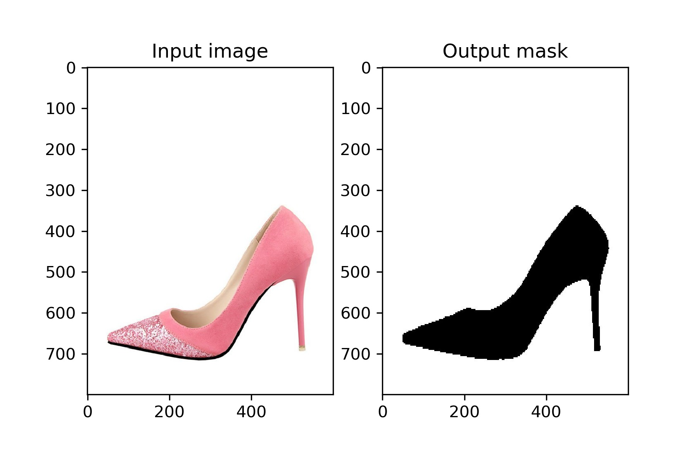

# Image-Segmentation-PyTorch

> [PyTorch](https://pytorch.org/) implementation of the [U-Net](https://arxiv.org/abs/1505.04597) for image segmentation.

[](LICENSE)

## Requirement

- Python 3
- numpy
- matplotlib
- Pillow
- torch
- torchvision
- pydensecrf

## Dataset

Based on the shoe dataset [[Google Drive]](https://drive.google.com/open?id=1UCKqFsGubgqkJgJB7cLS5GURRLH7fxzP) provided by our teacher.



## Usage

### Training

```sh
python train.py
```

### Inference

```sh
python train.py --inference True --checkpoint [*.pt]
```

The checkpoint files can be found in the `state_dict` folder.

### Show help message

```sh
python train.py -h
```

## Implemented model

Ronneberger, O., Fischer, P., and Brox, T. 2015. U-Net: Convolutional Networks for Biomedical Image Segmentation. In Medical Image Computing and Computer-Assisted Intervention (MICCAI). [[pdf]](https://arxiv.org/pdf/1505.04597)


## Notes

The model was trained from scratch on Tesla V100 32GB*4. Training the model takes 3.6GB of memory and predicting images takes 1.3GB. If you don't have enough GPU memory, consider using bilinear up-sampling rather than transposed convolution in the model.

## Acknowledgements

* Some of the code is borrowed from [milesial](https://github.com/milesial/Pytorch-UNet).
* This is a personal homework for "Machine Learning Theory and Application" in BUAA Summer School.

## License

MIT
